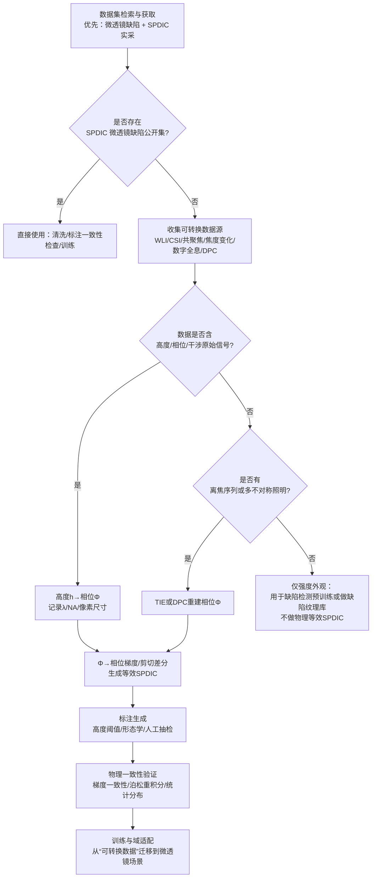

# 微透镜表面缺陷检测数据集深度调研与空间相位微分相衬等效转换评估

## 执行摘要

本次调研以“**微透镜（含微透镜阵列）表面缺陷检测**”为目标数据域，并以“**空间相位微分相衬显微镜（spatial phase differential interference contrast / spatial differential phase contrast，以下简称 SPDIC）直接采集**”为最高优先级。结论是：**公开可下载且明确标注为“微透镜表面缺陷 + SPDIC 直接采集”的数据集，未检索到可直接复用的成熟公开数据集**（更常见的情况是论文使用“真实数据”但未公开发布，或数据需联系作者/机构获取）。例如，公开页面可检索到针对微透镜阵列检测/评定的研究工作，但并未伴随标准化公开数据集发布入口（多为方法论文/报告层面）。 citeturn15search11turn14search14

在“无直接 SPDIC 微透镜缺陷数据集”的前提下，本报告给出两条更现实的落地路线：

**路线一：以“可量化相位/形貌（topography/height）”数据为核心，前向仿真生成等效 SPDIC。**  
这一类数据通常来自白光/相干扫描干涉（CSI/WLI）、共聚焦、焦度变化、或干涉显微学；它们天然携带高度/相位信息，最容易通过明确数学变换生成“相位梯度/微分相衬”观测。代表性公开数据源包括：CSI/共聚焦/焦度变化对比的 Zenodo 测量数据集（CC BY 4.0）、干涉显微镜传递函数与原始深度响应信号的 DaKS 数据集（CC BY 4.0）、以及同时提供显微图与白光干涉扫描的 OpticFusion WLI-OM 数据集（研究非商业许可）。 citeturn31view0turn37view0turn30view0turn13view0

**路线二：以“缺陷标注可用性”为核心，先用镜片/光学表面缺陷数据训练识别器，再用仿真或弱监督迁移到微透镜。**  
公开可见的“镜片划痕/光学表面缺陷”数据更可能提供实例分割标注（但往往缺乏相位/形貌，也未必是显微镜采集），可作为检测网络的预训练或弱监督起点；如 Roboflow 的镜片划痕实例分割数据集提供训练/验证/测试划分信息；GitHub 上也存在“工业弱划痕检测”示例图像集。 citeturn27view0turn24view0turn25view0

综合“可用性（可下载）/物理可转换性/标注质量/许可限制”，本报告优先推荐 3–5 个数据集用于构建“微透镜表面缺陷 → SPDIC 等效数据”的工程起步，并给出可操作的数学转换要点、预处理与物理一致性验证步骤，以及 Python/NumPy/FFT 伪代码示例。

## 检索范围与优先来源

本调研的检索范围与优先级按以下顺序执行（从高到低）：

优先检索“**原始论文随附数据**/作者提供的 data availability 链接/补充材料（supplementary）”，以及“**官方或机构数据仓库**”（高校/研究机构 repository、政府/标准机构数据服务）。其次检索“**通用公开数据平台**”，包括但不限于 Zenodo、IEEE DataPort、GitHub（含 release/附带数据）、以及其它公开托管站点；对需要登录/JS 渲染的平台，优先确认其 DOI、数据格式、体量、许可与访问门槛。  
在“微透镜 + 缺陷 + SPDIC/DIC/DPC/QPI/干涉/共聚焦/数字全息”等组合关键词下，重点关注以下两类结果：  
其一是**确实“微透镜表面缺陷”**但数据不公开（需联系作者）；其二是**可公开下载的形貌/相位/干涉显微数据**，可被明确变换/仿真为相位梯度或 DIC/DPC 类观测，从而构造“等效 SPDIC”。

## 候选数据集盘点与表格对比

下表将“直接微透镜相关但需联系作者/未公开标准数据集”的条目，与“可公开下载且可数学转换到 SPDIC”的条目，一并纳入候选对比（未知项明确标注为“未披露/需确认”）。

> 说明：表中“是否为空间相位微分相衬原始采集”严格指 **SPDIC/DIC/DPC 这类相位梯度/微分相衬模式的原始采集**；若数据源为高度/相位/干涉信号，则通常标为“否”，但在“可否转换”列给出可操作的转换路径。

| 数据集名称 | 来源/标识（DOI/平台） | 采集显微镜类型 | 采集模式 | 分辨率/像素尺寸 | 样本数量 | 缺陷类型标注（格式） | 文件格式 | 许可/使用限制 | 是否为微透镜表面 | 是否为SPDIC原始采集 | 可否通过数学变换转换为等效SPDIC | 下载方法与大小估计 | 备注 |
|---|---|---|---|---|---:|---|---|---|---|---|---|---|---|
| Automated inspection of microlens arrays（研究工作，数据需另行获取） | EPFL Infoscience 论文条目（未见公开数据下载入口） citeturn15search11 | 未披露（推测为光学成像/检测系统） | 未披露（多为强度/反射外观） | 未披露 | 未披露 | 未披露 | 未披露 | 未披露 | 是（微透镜阵列检测主题） citeturn15search11 | 否（未声明SPDIC） | 不确定：若仅强度图，需要额外成像参数与前向模型；若有多角度/离焦序列，可尝试 TIE/DPC 重建相位后再仿真SPDIC（见后文） | 需联系作者/机构；体量未知 | 适合作“微透镜场景真实性”的线索，但不宜作为直接可复现数据源 |
| Defects recognition of microlens array using gabor filters and SVM（研究工作，数据未公开） | PolyU Scholars Hub 条目（描述“真实数据”实验） citeturn14search14 | 未披露 | 未披露 | 未披露 | 未披露 | 未披露 | 未披露 | 未披露 | 是（微透镜阵列缺陷识别） citeturn14search14 | 否（未声明SPDIC） | 不确定：需要确认是否有相位/形貌或多幅序列；否则只能走仿真/弱监督迁移 | 需通过论文作者渠道获取；体量未知 | 可作为“应联系作者索取数据”的候选线索之一 |
| ScratchDetection（工业弱划痕图像集） | GitHub：love6tao/ScratchDetection citeturn24view0turn25view0 | 未披露（工业视觉/光学表面检测场景） citeturn24view0 | 强度（灰度外观） citeturn24view0 | 示例文件大小 768 KB（尺寸未明示） citeturn25view0 | 未在 README 给出总量（仓库含 scratchdateset 目录） citeturn11view0turn24view0 | 未见独立标注文件（需自行生成/弱监督） citeturn11view0turn24view0 | BMP citeturn48view0turn25view0 | 未在 README 明确数据许可（需检查仓库 License/声明） citeturn24view0 | 否（更像“大口径光学元件/表面”而非微透镜） citeturn24view0 | 否 | **较难直接等效**：仅强度单幅 → 相位梯度不适定；若能补充离焦/多照明，可用 TIE/DPC 近似恢复相位后再仿真SPDIC（后文给流程） citeturn66view0turn50view1 | Git clone；数据体量估计为 MB–十余MB级（取决于BMP数量） | 适合做“划痕缺陷外观检测”预训练或做弱监督标注生成 |
| lens-scratches（镜片划痕实例分割，Roboflow） | Roboflow Universe 数据集 v7：340 张、训练/验证/测试划分可见 citeturn27view0 | 未披露（可能为显微/近摄/工业相机） | 强度（外观） | 未披露 | 340（Train 270 / Val 40 / Test 30） citeturn27view0 | 有：实例分割（多边形/掩码导出取决于下载格式） citeturn27view0 | 平台可导出多种CV格式（页面未完全展开） citeturn27view0 | 平台条款约束；具体许可需在下载页/项目设置确认（页面未解析） citeturn27view0turn28view0 | 否（镜片/透明表面，不等同微透镜） | 否 | **可做“缺陷分割器”预训练**；到SPDIC需“形貌/相位”补全（可在微透镜几何上做缺陷形貌合成，再仿真SPDIC） | 通过 Roboflow 下载；体量取决于导出格式与图像分辨率 | 标注质量通常优于无标注数据，但物理可转换性弱 |
| 微亿智造透明物体表面缺陷识别和分类数据集（线索，访问需JS/账号） | selectdataset 条目给出下载线索（江苏数据知识产权登记系统），但目标站点需启用 JS citeturn19view0turn20view0 | 未披露 | 未披露（描述强调“透明镜片表面缺陷信息”） citeturn19view0 | 未披露 | 未披露 | 说明提到“标注后的缺陷信息”，且数据格式为 Excel（偏“结构化标签”，未必含原始图像） citeturn19view0 | Excel（按条目描述） citeturn19view0 | 未披露（可能有登记/使用限制） citeturn19view0turn20view0 | 否（透明镜片≠微透镜） citeturn19view0 | 否 | 若仅 Excel 标签而无相位/形貌与原始图像，则**无法转换**；若可获得配套形貌/显微图，才可考虑 | 需在登记系统内下载；体量未知 citeturn20view0 | 属于“产业侧数据线索”，但工程可复现性不确定 |
| OpticFusion WLI-OM Dataset（WLI + 光学显微） | GitHub：zju3dv/OpticFusion（Dropbox 链接在 README） citeturn13view0turn30view0 | Dino-Lite AM7915MZT（光学显微） + Zygo Newview 8200（白光干涉/WLI） citeturn13view0 | 强度（OM 多视角） + 干涉测量得到 3D 表面 citeturn13view0 | README 未给像素尺寸；需以数据内元信息为准 | 5 个序列；每个样本含 37 张 OM 图、5 个 WLI 扫描 citeturn13view0 | README 未声明缺陷掩码；需自建标注或用 WLI 高度阈值/形态学生成弱标签 | 未在摘要页写明（通常 OM 为图像文件，WLI 为点云/高度图/仪器格式） | 仅教育/科研/非营利；禁止商业；衍生修改需开源；商业用途需邮件联系 citeturn30view0 | 否（微结构，不特指微透镜） | 否 | **是（强推荐）**：WLI 高度 → 相位/OPD → 相位梯度 → 仿真SPDIC；OM 图可作为“强度外观对照” | 按 README 提供的下载链接获取；体量取决于序列数量（通常 GB 级） citeturn13view0 | 兼具“外观强度 + 真实3D形貌”，非常适合做物理一致性验证 |
| Dataset for CSI/FV/Confocal topography comparison（Euspen 数据） | Zenodo DOI: 10.5281/zenodo.10365872（CC BY 4.0，68MB） citeturn31view0 | CSI（相干扫描干涉）+ Confocal microscopy（共聚焦）+ Focus variation（焦度变化） citeturn31view0 | 3D 表面形貌（topography）/测量结果文件 citeturn31view0 | 未披露（需由 .plux 元数据读取） citeturn31view0 | 6 个 .plux 文件（记录页显示 Files 68MB） citeturn31view0 | 无缺陷标注（测量数据用于方法对比） | .plux citeturn31view0 | CC BY 4.0 citeturn31view0 | 否 | 否 | **是（推荐）**：高度/相位数据适合生成“相位梯度/微分相衬”；可做仪器差异对仿真鲁棒性评估 | Zenodo 直接下载；约 68MB citeturn31view0 | 体量小、许可友好、适合快速打通 pipeline |
| Three-Dimensional Transfer Functions of Interference Microscopes（Mirau CSI 原始信号+形貌） | DaKS DOI: 10.48662/daks-33（CC BY 4.0，Measurement data.zip 1.33GB） citeturn37view0 | Mirau coherence scanning interferometer：50x, NA=0.55, red LED（630 nm） citeturn37view0 | 干涉显微原始深度响应信号 + 3D 表面 topography（HDF5） citeturn37view0 | 未披露（需读 HDF5 元信息） | 1 组 Measurement data.zip + 内含 raw 与 result citeturn37view0 | 无缺陷标注（偏“仪器/算法验证数据”） | HDF5 citeturn37view0 | CC BY 4.0 citeturn37view0 | 否 | 否 | **是（推荐）**：可从 topography/相位重建得到相位梯度并仿真SPDIC；也可用于校准“干涉→高度→相位”的链路 | DaKS 直接下载；约 1.33GB citeturn37view0 | 含明确波长/NA 等参数，有利于物理一致性建模 |
| The Surface-Topography Challenge（多实验室 wafer/表面 twin 容器） | Zenodo DOI: 10.5281/zenodo.15341939（36.6GB） citeturn44view1turn45view0 | 多仪器、多实验室（原始格式各异，另含 NetCDF 统一表示） citeturn45view0 | 原始测量 + 标准化 NetCDF（.nc）形式的 topography/测量 citeturn45view0 | 各样本不同（元数据在 meta.yml / 容器内说明） citeturn45view0 | 多个 allData_wafer_*.zip（合计 36.6GB） citeturn44view1 | 无统一“缺陷掩码”；更偏“测量基准挑战”与报告 | zip + .nc + 原始格式 citeturn45view0 | **每个 digital surface twin 内含 license file，复用条件需逐个确认** citeturn45view0 | 否 | 否 | **是（强推荐但工程成本较高）**：可从 .nc 直接做相位/梯度/SPDIC 仿真；可用于构造“缺陷纹理库”再贴合到微透镜几何 | Zenodo 下载；约 36.6GB citeturn44view1 | 规模大、仪器多样，适合做泛化与不确定性分析 |
| Dataset on micro-milled textures & friction（微铣削表面形貌） | Zenodo DOI: 10.5281/zenodo.18014400（158.8MB，CC BY 4.0） citeturn43view0 |（未在记录页显式给出仪器类型；通常为表面形貌测量仪器，需看 zip 内说明） citeturn43view0 | 3D 表面形貌数据（zip 内） + 统计/文档 citeturn43view0 | 未披露 | 32 种 micro-milled textures（描述给出） citeturn43view0 | 无缺陷掩码（偏材料摩擦研究） | xlsx/txt/pdf/docx/zip citeturn43view0 | CC BY 4.0 citeturn43view0 | 否 | 否 | 是：高度→相位→梯度→SPDIC 仿真；适合作“划痕/纹理类缺陷”背景库 | Zenodo 直接下载；约 158.8MB citeturn43view0 | 适合做“可控纹理/微加工缺陷”的先验库 |
| Lytro Illum Calibration Dataset（微透镜阵列相机原始数据，非缺陷） | IEEE DataPort DOI: 10.21227/xr78-kq36（需登录访问文件） citeturn42view0 | Lytro Illum（微透镜阵列光场相机） citeturn42view0 | 光场相机原始强度（.lfp）+元数据 citeturn42view0 | 未披露（取决于 Lytro 原始分辨率与解码） | 多 zip：white images 1.56GB；校准集 2.6GB×2 等 citeturn42view0 | 无“缺陷标注” | .lfp + .json/.txt citeturn42view0 | Open Access 但需登录；页面同时提到订阅/登录机制（以实际页面提示为准） citeturn42view0 | **是（微透镜阵列成像系统）** citeturn42view0 | 否 | 仅可用于“微透镜阵列几何/成像模型”辅助；不能直接生成微透镜表面缺陷SPDIC | IEEE 账号登录后下载；总量约 6–8GB 量级（按列出的 zip 规模） citeturn42view0 | 对“微透镜阵列结构参数/采样几何”的仿真有价值，但不解决表面缺陷数据缺口 |
| PD-DPC 示例数据（DPC 四幅强度→相位重建，非微透镜） | GitHub：zhoujinhua2015/Pupil-Driven-Differential-Phase-Contrast（MIT） citeturn48view0 | 差分相衬/差分相位对比（DPC）系统（基于不对称照明） citeturn48view0 | 4 幅原始 DPC 强度图（r1–r4）→构建 DPC 通道→PTF 反卷积重建相位 citeturn48view0turn50view1 | 示例 BMP 尺寸未披露 | 小型示例数据 + 示例输出 citeturn48view0 | 无缺陷标注（偏相位重建算法验证） | BMP + MATLAB 输出 citeturn48view0 | MIT License（代码）；数据随仓库分发 citeturn48view0 | 否 | 否（但属于“差分相衬/相位梯度”同族） | **是（方法对齐用）**：已在 DPC 域，可用来验证“DPC→相位→仿真SPDIC”的一致性 | Git clone；体量很小（MB 级） citeturn48view0 | 建议作为“算法与仿真正确性基准”，而非目标领域数据 |

## 从其他显微/测量数据到等效空间相位微分相衬的转换方法要点

### SPDIC 的“物理等效目标”定义

你们的目标成像（SPDIC）可以在工程上等效为：**输出与样品相位（或光程）在某一剪切方向上的梯度/差分单调相关**的图像（可能还叠加了偏置相位、系统调制与噪声）。DIC 的核心机制是把“光路长度/相位的梯度变化”转为强度对比，呈现类似浮雕的边缘增强效果。 citeturn22search1turn22search0

因此，只要数据源能让你得到或可靠估计以下任一物理量，就能较严格地生成 SPDIC 等效数据：

- **定量相位/光程分布**：\(\Phi(x,y)\)（例如 QPI、DPC 重建相位、数字全息重建相位等）。  
- **表面高度形貌**：\(h(x,y)\)（例如 CSI/WLI、共聚焦 3D、焦度变化 3D、干涉显微重建 topography）。  
- **多幅强度观测**（满足一定传播/照明条件）：例如离焦序列用于 TIE，或多方向不对称照明用于 DPC。

下面给出三条最可落地的“变换/仿真路径”。

### 路径 A：高度/形貌 \(h(x,y)\) → 相位 \(\Phi(x,y)\) → SPDIC

这条路径适用于：OpticFusion（WLI 扫描）、Zenodo 10365872（CSI/共聚焦/焦度变化）、DaKS 干涉显微 topography、Surface-Topography Challenge（.nc 包含 topography）等。 citeturn13view0turn31view0turn37view0turn45view0

**高度到相位的关键关系（反射式/干涉测量常见场景）**  
干涉显微中条纹频率与波长呈 \(4\pi/\lambda\) 量级关系；在相移干涉/相位测量中，表面高度噪声与相位噪声满足 \(N = \frac{\lambda}{4\pi}N_\theta\) 的标度关系（反推也可视为“相位↔高度”的基本比例约束）。 citeturn57view0turn59view0  
工程上常用近似（法向入射、反射双程）为：  
\[
\Phi(x,y) \approx \frac{4\pi}{\lambda}\,h(x,y)
\]
若是**透射式微透镜**（厚度起伏导致光程差），可用更一般的光程模型：  
\[
\Phi(x,y) \approx \frac{2\pi}{\lambda}\,\Delta \mathrm{OPL}(x,y),\quad \Delta \mathrm{OPL} \approx (n_\text{lens}-n_\text{medium})\,\Delta t(x,y)
\]
其中 \(\Delta t\) 可以用“微透镜相对基准面厚度差”近似（若只测得表面 sag，需要结合背面/基准定义）。

**相位到 SPDIC 的前向模型（推荐两档）**

- **线性梯度近似（快速、稳健）**：设剪切方向单位向量 \(\mathbf{u}\)，剪切距离（物方）\(s\)。  
  \[
  G(x,y)=\mathbf{u}\cdot \nabla\Phi(x,y)
  \]
  将 \(G\) 归一化为 \([0,1]\) 灰度即可作为“等效 SPDIC”。该模型直接捕捉“边缘增强/梯度对比”的核心。DIC 的对比与光程梯度相关这一点在典型介绍中明确指出。 citeturn22search1turn22search0

- **带偏置的干涉强度模型（更接近 DIC 外观）**：  
  令 \(\Delta\Phi(x,y)=\Phi(x+s\mathbf{u})-\Phi(x-s\mathbf{u})\approx 2s\,(\mathbf{u}\cdot\nabla\Phi)\)。  
  \[
  I_\text{DIC}(x,y)=I_0(x,y)+A(x,y)\cos\!\big(\phi_b+\Delta\Phi(x,y)\big)
  \]
  其中 \(\phi_b\) 是 Nomarski bias（偏置相位），用于把工作点拉到近似线性区；DIC “通过两束剪切光干涉、对 OPL 差敏感，并可引入 offset phase 调对比”的描述属于标准原理。 citeturn22search0turn22search1  
  取 \(\phi_b\approx \pi/2\) 时，小信号近似下 \(I_\text{DIC}\) 近似与 \(\Delta\Phi\) 成正比，便于控制动态范围。

**缺少成像参数时的合理假设范围（建议在元数据缺失时明确记录）**  
剪切量在 DIC 中常见为亚微米量级（例如约 0.2 μm 的剪切位移在一些说明中被作为典型量级提及）。 citeturn22search0  
建议默认假设：\(\lambda \in [450,650]\)nm（可见光）、物镜 NA 取 0.3–0.8、剪切（物方）取 0.1–0.5 μm 或换算为 1–5 像素（取决于像素标定）。

### 路径 B：DPC 强度（多不对称照明）→ 相位重建 → SPDIC

这条路径适用于：已经是 DPC 家族数据的公开仓库（例如 PD-DPC 示例数据），或者你未来自行采集的多照明显微图。PD-DPC 仓库明确给出：输入四幅在不同不对称照明下采集的强度图（r1–r4），构建两轴 DPC 测量，并由显微镜参数计算相位传递函数（PTF），再重建相位/OPD。 citeturn48view0

**核心数学：DPC 的 PTF 反卷积重建相位**  
Fan 等对 DPC 的弱物体近似推导给出：一旦光学系统（物镜 pupil）固定，PTF 由照明函数决定，并可用 Tikhonov 等正则做单步反卷积重建相位。其文中给出 PTF 表达式与重建公式（示意为 \(\phi=\mathcal{F}^{-1}\{\frac{\sum PTF_i^* I_i^{DPC}}{\sum |PTF_i|^2+\beta}\}\)）。 citeturn50view1turn50view0  
得到 \(\Phi(x,y)\) 后，直接套用“路径 A 的相位→SPDIC”即可。

这一路径的价值在于：你可以把 DPC 视作“与 SPDIC 同族的相位梯度测量”，用公开 DPC 示例先把 PTF 管线、正则策略、噪声模型跑通，再迁移到“微透镜形貌→仿真 SPDIC”的主任务。

### 路径 C：强度离焦序列（TIE）→ 相位 → SPDIC

当你只有强度图，但能获得**至少两幅不同离焦量**的强度 \(I(x,y,z\pm \Delta z)\) 时，可用 TIE 做非干涉相位恢复，再仿真 SPDIC。

**TIE 基本形式**  
Wikipedia 对 TIE 的描述给出其典型写法：  
\[
\frac{2\pi}{\lambda}\frac{\partial I(x,y,z)}{\partial z}=-\nabla_{x,y}\cdot\big(I(x,y,z)\nabla_{x,y}\Phi(x,y,z)\big)
\]
并指出在“常强度”假设下可化简为与 \(\nabla^2\Phi\) 相关的形式。 citeturn66view0

**工程流程要点**  
用有限差分近似 \(\partial I/\partial z\)，然后在合适边界条件与正则下求解泊松型方程得到 \(\Phi\)。随后用“路径 A：\(\Phi\rightarrow\)SPDIC”。  
需要注意：TIE 对噪声、边界条件、以及离焦量标定较敏感；但作为“缺少相位/形貌时的补救方案”，它比“单幅强度直接推相位梯度”更可辩护。

**与 DIC 的联系提示（用于验证与扩展）**  
Optica 的 TI-DIC（TIE + DIC）工作摘要强调：DIC 本质上是定性相位成像，得到的图像混合了相位梯度与振幅信息；通过在 DIC 上引入 TIE 并利用 through-focus DIC 图像，可恢复更线性的相位信息。 citeturn51view0  
对你们而言，这意味着：  
- “由相位仿真 DIC/SPDIC”是天然可行的前向过程；  
- 若未来你们能采集到 DIC/SPDIC 的离焦序列，还可走反问题恢复相位/形貌，用于缺陷的计量级验证。

## 优先推荐的数据集清单与推荐理由

结合“能否直接下载”“物理可转换到相位梯度/微分相衬”“许可可用性”“是否含多模态支撑验证”，优先推荐如下 5 个（按工程落地优先级）：

**OpticFusion WLI-OM Dataset（强推荐，做主力形貌→SPDIC）**：同时提供白光干涉（Zygo Newview 8200）表面扫描与光学显微多视角图像（Dino-Lite），且每个样本包含多张 OM 与多次 WLI 扫描，利于做跨模态配准、用 WLI 高度构造“物理一致”的缺陷标签或弱标签。 citeturn13view0  
限制在于许可为“教育/科研/非营利，禁商业”，需要与你们项目合规性对齐。 citeturn30view0

**Zenodo 10.5281/zenodo.10365872（快速打通管线，许可友好）**：体量小（68MB）且 CC BY 4.0，可直接用于验证“CSI/共聚焦/焦度变化”三类 topography 数据到 SPDIC 的仿真一致性与噪声敏感性。 citeturn31view0

**DaKS 10.48662/daks-33（强推荐，干涉显微原始过程可追溯）**：不仅给出 3D topography，还提供 Mirau CSI 的原始深度响应信号并采用 HDF5，且明确给出倍率/NA/波长（630nm）等关键参数；非常适合做“从仪器参数到仿真 SPDIC”的可解释链路。 citeturn37view0

**Zenodo 10.5281/zenodo.15341939 Surface-Topography Challenge（强推荐但工程量大）**：36.6GB 多实验室、多仪器、多原始格式并提供 NetCDF（.nc）统一表示，可作为“缺陷纹理/形貌库”用于构建更广覆盖的微透镜缺陷合成集合；但许可需逐个样本容器内确认（每个 twin 含 license file）。 citeturn44view1turn45view0

**Roboflow lens-scratches（作为缺陷分割预训练/标注范式参考）**：提供实例分割任务与明确的数据划分（340 张、train/val/test），可用来预训练缺陷分割器、验证标注格式与数据工程管线；之后再用“形貌仿真 SPDIC + 少量真实采集”做域适配。 citeturn27view0  
局限在于缺少相位/形貌与显微参数，物理转换到 SPDIC 需要额外合成/建模步骤。

> 不列入“优先推荐”但建议保留线索：微透镜阵列检测相关论文条目（EPFL/PolyU）可作为“联系作者索取数据”的目标清单，但不应作为可复现实验的唯一数据来源。 citeturn15search11turn14search14

## 预处理、仿真生成与物理一致性验证步骤（含示例伪代码）

以下流程针对“形貌/相位 → 等效 SPDIC → 缺陷检测训练”这一主路线（也适用于多模态：OM + WLI/CSI）。

### 数据预处理与标定要点

首先做“几何与单位一致化”，再做“噪声与伪影处理”，最后做“标注一致性与物理一致性验证”。

对 3D topography / height map：

- 去除 piston/tilt（平面拟合扣除）与低频形状项（可选：只保留缺陷尺度频段）。  
- 统一单位到米（m）或微米（µm），并记录像素间距（lateral sampling）。若缺失，必须在实验记录中以合理区间假设并标注不确定性来源。  
- 缺陷候选生成：可用高度阈值（如 \(|h-h_\text{fit}|>\tau\)）+ 形态学操作生成“弱标签”，再人工抽样校验，逐步迭代。

对相位/OPD（若存在）：

- 相位展开（unwrap）与去除全局斜坡项。  
- 对 speckle/条纹噪声做滤波（如小波/TV/非局部均值），并保持边缘。

对多模态（OM 与 WLI/CSI）配准：

- 先做尺度统一（根据像素尺寸与倍率），再做刚性/仿射配准（互相关/特征点），必要时做局部弹性（薄板样条/光流）但需谨慎避免“制造缺陷形状”。  
- 记录配准误差（例如在若干控制点的 RMSE），作为后续训练时的噪声模型一部分。

### SPDIC 等效仿真与验证

核心验证目标是：**仿真 SPDIC 是否在统计意义上符合“相位梯度成像”的物理预期**，并能在反向上恢复主要结构（至少在低频上）。

建议最少做两类一致性检查：

- **梯度一致性**：从高度→相位→梯度得到的 \(\mathbf{u}\cdot\nabla\Phi\) 与 “剪切差分” \(\Phi(x+s\mathbf{u})-\Phi(x-s\mathbf{u})\) 在小剪切下应高度相关（线性相关系数接近 1）。  
- **可逆性（弱）**：对仿真的梯度场做泊松积分（在合适边界条件下）应能恢复一个与原相位一致的相位（差一个常数/线性项），用于排查实现错误。

### Python/NumPy/FFT 伪代码示例

下面给出一个“高度图 → 相位 → SPDIC（线性梯度近似 + 可选干涉外观）”的最小实现骨架（强调工程可用性而非极致光学精度）：

```python
import numpy as np

def remove_plane(h):
    """去除高度图的平面项（piston + tilt），用于减少低频主形状影响。"""
    ny, nx = h.shape
    yy, xx = np.mgrid[0:ny, 0:nx]
    A = np.stack([np.ones_like(xx).ravel(), xx.ravel(), yy.ravel()], axis=1)
    coef, *_ = np.linalg.lstsq(A, h.ravel(), rcond=None)
    plane = (A @ coef).reshape(ny, nx)
    return h - plane

def height_to_phase_reflection(h_m, wavelength_m=550e-9):
    """
    反射式近似：phi ~ 4*pi*h/lambda
    注：干涉显微中 4π/λ 的标度与高度-相位关系在经典干涉显微综述中反复出现。citeturn57view0turn59view0
    """
    return (4.0 * np.pi / wavelength_m) * h_m

def phase_gradient(phi, dx_m, dy_m, direction="x"):
    """计算相位梯度（中心差分）。"""
    if direction == "x":
        return (np.roll(phi, -1, axis=1) - np.roll(phi, 1, axis=1)) / (2.0 * dx_m)
    if direction == "y":
        return (np.roll(phi, -1, axis=0) - np.roll(phi, 1, axis=0)) / (2.0 * dy_m)
    raise ValueError("direction must be 'x' or 'y'")

def simulate_spdic_linear(phi, dx_m, dy_m, u=(1.0, 0.0), eps=1e-12):
    """
    SPDIC 等效（线性梯度）：
    I ~ normalize(u·∇phi)
    """
    ux, uy = u
    gx = phase_gradient(phi, dx_m, dy_m, "x")
    gy = phase_gradient(phi, dx_m, dy_m, "y")
    g = ux * gx + uy * gy

    # robust normalize to [0,1]
    p1, p99 = np.percentile(g, [1, 99])
    g = np.clip((g - p1) / (p99 - p1 + eps), 0, 1)
    return g

def simulate_dic_interference(phi, dx_m, dy_m, shear_px=2, bias=np.pi/2, eps=1e-12):
    """
    更“像DIC外观”的仿真：
    I = 0.5 + 0.5*cos(bias + delta_phi)
    delta_phi ~ phi(x+shear) - phi(x-shear)
    DIC 对比与光程/相位梯度相关的原理见 DIC 介绍。citeturn22search1turn22search0
    """
    phi_f = np.roll(phi, -shear_px, axis=1)
    phi_b = np.roll(phi,  shear_px, axis=1)
    dphi = phi_f - phi_b

    I = 0.5 + 0.5 * np.cos(bias + dphi)
    I = np.clip(I, 0, 1)
    return I
```

若你的输入是 DPC 四幅强度（r1–r4），可先按“PTF 反卷积”重建相位，再调用上述仿真函数。Fan 等给出了 DPC 的 PTF 表达与反卷积重建形式；PD-DPC 仓库也明确了“用四幅不对称照明图 → 计算 PTF → 重建相位”的步骤与所需显微参数（波长、NA、像素尺寸等）。 citeturn50view1turn48view0

对于 TIE（离焦强度序列）路线，可参考其标准形式：\(\frac{2\pi}{\lambda}\partial_z I = -\nabla\cdot(I\nabla\Phi)\)。 citeturn66view0  工程上常把 \(\partial_z I\) 用两幅离焦差分估计，并在“常强度”或“弱变化强度”假设下把问题简化为泊松方程，用 FFT 反拉普拉斯求解。

## 转换与建库的推荐流程图（Mermaid）



这张流程图对应本文的核心策略：当缺少“微透镜 + SPDIC 实采 + 缺陷标注”三者同时满足的数据集时，优先用“可量化形貌/相位”的公开数据建立可解释的 SPDIC 等效合成管线，再通过少量真实微透镜采集进行域适配闭环。

---

**脚注式参考（用于快速定位 DOI/关键来源）**  
- Zenodo：CSI/FV/Confocal 测量数据集 10.5281/zenodo.10365872（CC BY 4.0，68MB）。 citeturn31view0  
- DaKS：干涉显微传递函数与原始数据 10.48662/daks-33（CC BY 4.0，1.33GB）。 citeturn37view0  
- Zenodo：Surface-Topography Challenge 10.5281/zenodo.15341939（36.6GB；license 按容器内文件确认）。 citeturn44view1turn45view0  
- Zenodo：micro-milling textures 10.5281/zenodo.18014400（CC BY 4.0，158.8MB）。 citeturn43view0  
- IEEE DataPort：Lytro Illum Calibration 10.21227/xr78-kq36（.lfp，需登录访问文件）。 citeturn42view0  
- DPC→相位重建（PTF/反卷积）推导与公式示例：Fan et al.（arXiv:1903.10718）页面截图含 PTF 与重建式。 citeturn50view1turn50view0  
- TIE 基本方程形式：Wikipedia 条目给出经典表达式。 citeturn66view0